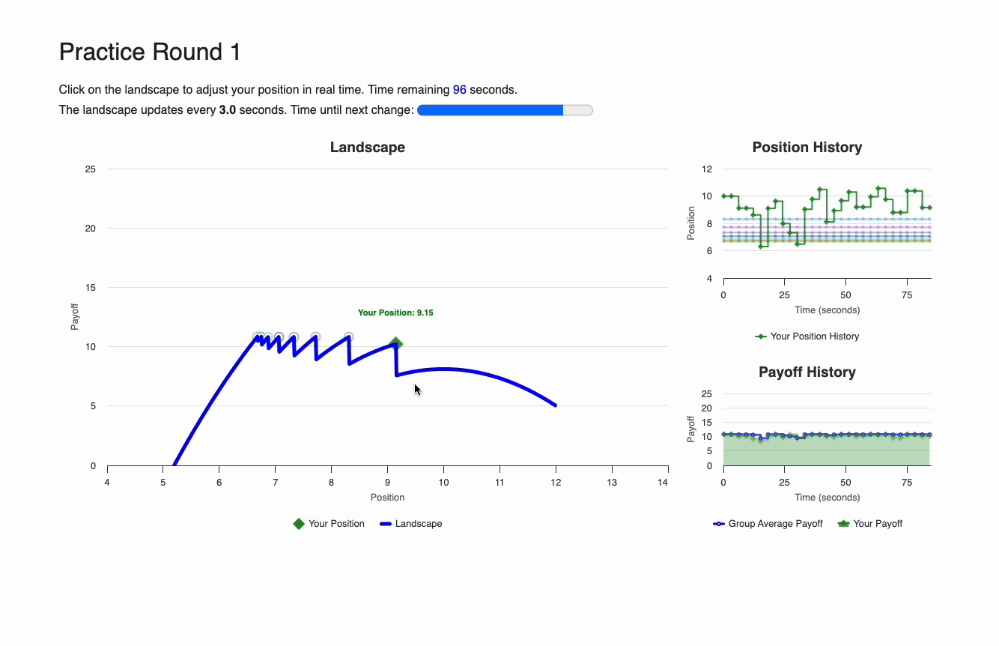

# TimingGames(oTree 5 Version)
Design for a timing game with oTree version 5.10.3.

# Display


# 1 Steps to initiate the game in local

## 1.1 clone git repository
- In the terminal, navigate to a directory where you wish to clone this git repository to.
- To clone the repo, run
 ```
 git clone https://github.com/biubiuworld/timing_games_v5.git
 ```

## 1.2 create virtual environment
- To install `virtualenv` run 
```
pip3 install virtualenv
```
- In the terminal, navigate to the directory where this git repository is cloned at.
- Set up a virtual enviromment called `venv` for the project:
```
python3 -m virtualenv venv
```
- Activate the environment:
```
source venv/bin/activate
```
a `(venv)` should appear at the beginning of your terminal prompt.

## 1.3 Install packages
```
pip install otree==5.10.3 numpy
```
you can check if the package is successfully installed by run `pip list`.

## 1.4 Run the project locally
```
otree devserver
```
## 1.5 deactivate the venv
- After finishing the project, deactivate the environemnt:
```
deactivate
```

# 2 Steps to run the game in local (not initially)

## 2.1 change the dirctory
- In the terminal, navigate to the directory where this git repository is cloned at.

## 2.2 pull from the github
```
git pull
```

## 2.3 activate the virtual environment
```
source venv/bin/activate
```
## 2.4 run the project locally
```
otree devserver
```
## 2.5 deactivate the venv
- After finishing the project, deactivate the environemnt:
```
deactivate
```

# 3 How to change parameters
- Open the `demo.csv` in `\configs` folder. Change the parameter values accordingly.

# 4 Config fields
- `ROUND`: current round number
- `PERIOD_LENGTH`: how many seconds for this round
- `SUBPERIOD`: update frequency
- `XMAX/XMIN`: x-axis bounds
- `YMAX/YMIN`: y-axis bounds
- `LAMBDA/GAMMA/RHO`: parameters for payoff function
- `FREEZE_PERIOD`: number of subperiods that the player is disabled to move


